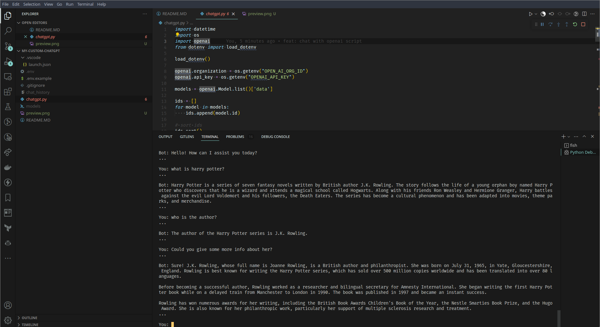
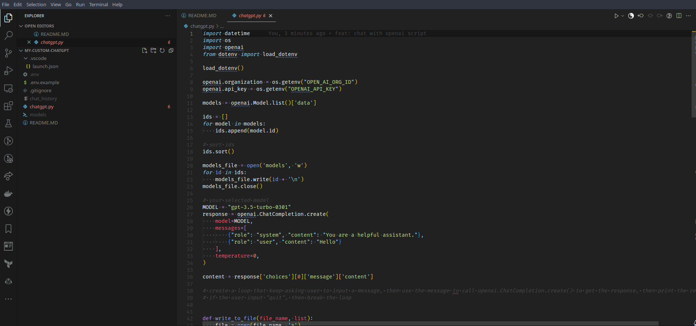

# Chat With OpenAI Script
Just a python script to quickly chat with OpenAI. You can modify it base on your appetite.

## Requirements:
- Python 3.9.4 or higher
- pip that works with Python 3.9.4 or higher
- OpenAI API Key and Organization ID
- VS Code (latest version)

## Install:
- Run `pip install openai`
- Run `pip install dotenv`

## Pre-run:
- Create `.env` file within the root folder of this repository with information like in `.env.example`, you should input your OpenAI API Key and Organization ID here.

## Run:
- Open your `chatgpt.py` file in VS Code, press F5 and enjoy.

## Stop:
- Type `quit` to stop.

## Error handler:
- If you get an error, please check your `.env` file and make sure you have all the information in there.
- If you get error on the OpenAI module, maybe just simple turn it off and run it again.
- If you get any other error, please open an issue on this repository.

##